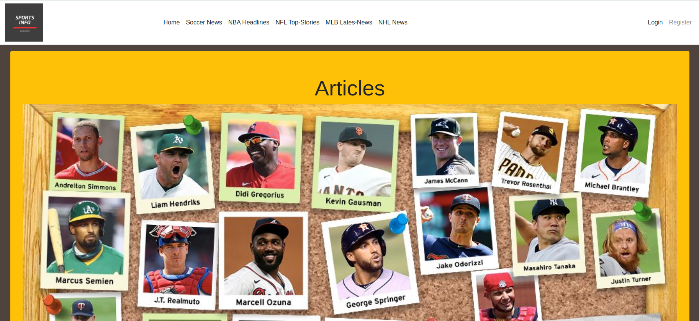

# Rails Capstone Project

> This project was about creating Sports Article App,where the users will have the choice to select from
> several categories and get articles that are making references to the respective categories. The user can
> create their own articles as well and add categories to add value to the app.

Additional description about the project and its features.

## Built With

- Ruby
- Ruby on Rails
- Boostrap
- PostgreSQL

## Live Demo

[Live Demo Link](https://morning-island-07101.herokuapp.com/)

## Getting Started

To get a local copy up and running follow these simple example steps.

- First thing is to clone the repo by clicking on the green button that says "code" on the top right corner
- and in your command line please run this commands
- ` git clone git@github.com:cvilla714/rails-capstone.git`
- then run `cd rails-capstone/`
- this will get you in the directory where the app is.
- Please follow the setup and install sections to get the app working

### Prerequisites

- Ruby:2.7
- Rails: 6.0.3.4
- PostgreSQL: 12.5

### Install

- Please run `bundle install` to install of the gems that are needed for the app to work

### Setup the database

- Please run ` rails db:create`
- then run `rails db:migrate`
- and finally run `rails db:seed`

### Usage

- In order to start the app , please run in your command line `rails server`. This will start the server
- Next step is to open a window in your webbrowser and type `http://localhost:3000/ ` this will get you to the home page and allow you to use the app

### Run tests

- To run the test please type `rpsec --format documentation`

### Deployment

> In order to deploy this app to Heroku follow the steps below

- First you need to install the Heroku CLI (stands for Command Line) by following [this link](https://devcenter.heroku.com/articles/heroku-cli)
- After successfully installing the Heroku CLI you need to run this command ` heroku create`
- Verify your heroku git remote was created by running `git remote`. You should see `heroku` as one of your remotes.
- Run `git push heroku master`. This will deploy the master branch of your git repository to Heroku.
- If you get a successfull message after Heroku finishing deploying, you're goog to go! you can open your brower with `heroku open`
- If you probably get a notice error. Is because you need to create the database and tables on Heroku's server you can do that by typing
- ` heroku run rails db:migrate`
- `heroku run rails db:seed`

## Authors

👤 **Cosmel Villalobos**

- Github: [@cvilla714](https://github.com/cvilla714)
- Twitter: [@kckeyti](https://twitter.com/kckeyti)
- LinkedIn: [Cosmel Villalobos](https://www.linkedin.com/in/cosvilla/)

## 🤝 Contributing

Contributions, issues, and feature requests are welcome!

Feel free to check the [issues page](https://github.com/cvilla714/rails-capstone/pulls).

## Show your support

Give a ⭐️ if you like this project!

## Acknowledgments

- Nelson Sakwa on Behance
- Bootstrap
- Font Awesome

## 📝 License

This project is [MIT](https://github.com/cvilla714/rails-capstone/blob/development/LICENSE) licensed.
